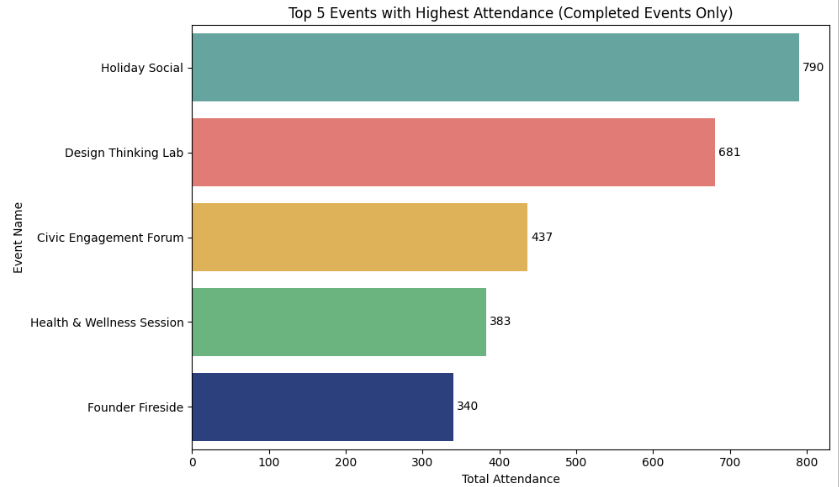
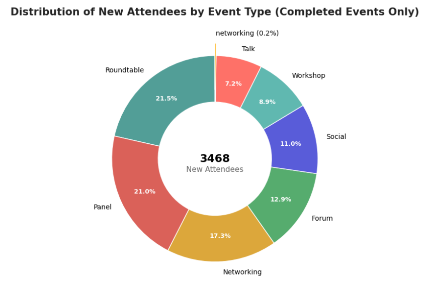

# 📊 YNCN Data Science Challenge Analysis  

<p align="center">
  
</p>

---

## 🌐 Challenge Repository  

This project is based on the official YNCN Data Science Challenge dataset and problem statement:  

🔗 **Official Challenge Repository**  
https://github.com/BaronLiu1993/YNCN-DS-Challenge-2026-2027  

---

## 🧠 Objective  
Analyze event participation data to identify **high-performing events and attendee patterns**, focusing on attendance trends and new attendee distribution across event types.

---

## 📊 Project Overview  
This project applies **data cleaning, transformation, and visualization techniques using Python** to answer key business questions from the challenge dataset.  

## 🔍 Highlights
- Flattened nested JSON data into a structured format for analysis  
- Cleaned and standardized inconsistent categorical and numeric fields  
- Removed duplicate and invalid records to ensure data quality  
- Performed aggregation and analysis to extract meaningful insights  
- Built clear visualizations including **bar charts and donut charts**  

---

## ❓ Key Business Questions  

- Which 5 events had the highest attendance?  
- How many new attendees were there by event type?  

---

## ✅ Outcomes  

### 🔝 Top 5 Events by Attendance  
- Identified the highest performing events based on total attendance  
- Enabled comparison of event success and engagement levels  

### 👥 New Attendees by Event Type  
- Analyzed distribution of new attendees across different event categories  
- Highlighted which event types are most effective in attracting new participants  

---

## 🗂️ Folder Structure  

| Folder | Description |
|--------|-------------|
| `Challenges/` | References the official challenge repository |
| `Images/` | Contains visualization screenshots and banner image |
| `Aarti_Zikre_data.ipynb` | Main notebook with data cleaning, analysis, and visualization |
| `README.md` | Project documentation |

---

## 🧰 Tools & Technologies  

| Category | Tools |
|----------|-------|
| Programming | Python, Jupyter Notebook |
| Data Processing | Pandas, NumPy |
| Visualization | Matplotlib, Seaborn |
| Data Source | JSON |
| Collaboration | Git, GitHub |

---

## 🧹 Data Cleaning Approach  

- Converted nested JSON into tabular format using `json_normalize`  
- Standardized categorical values such as event type and status  
- Handled missing, null, and inconsistent values  
- Converted numeric fields and validated attendance data  
- Removed duplicate and logically invalid records  

---

## 🧰 Cloning Instructions  

```bash
# Clone the repository
git clone https://github.com/Aartizikre150/YNCN-DS-Challenge-2026-2027.git

# Navigate to the project
cd YNCN-DS-Challenge-2026-2027
```
## 📊 Visualizations  

<p align="center">
  
  
</p>
